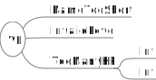

% Gérer les erreurs avec l'aide du système de types de Scala !
% David Sferruzza
% 22/04/2016

# À propos de moi

- [\@d_sferruzza](https://twitter.com/d\_sferruzza)
- [github.com/dsferruzza](https://github.com/dsferruzza)
- développeur et responsable R&D chez [Escale](http://www.escaledigitale.com)
- doctorant en génie logiciel à l'Université de Nantes
- écrit des projets perso et pro en Scala et en Haskell (notamment) depuis ~ 2 ans


# Cas d'exemple

Un joueur est ajouté à notre application.

```json
{ "name": "Batman", "level": 99, "hp": 85 }
```

Le JSON est parsé et les erreurs de structure gérées.

```scala
case class Player(name: String, level: Int, hp: Int)
```

On veut valider ces données avec des critères métier.

```scala
// On veut implémenter cette fonction
def validate(player: Player): ValidPlayer = ???

case class ValidPlayer(name: String, level: Int, hp: Int)
// ^ Même structure que Player
```


# Cas d'exemple

```scala
case class Player(name: String,
                  level: Int,
                  hp: Int)
```

Pour qu'un joueur soit valide (et devienne un `ValidPlayer`), il doit respecter ces **3** critères :

- longueur de nom supérieur à 3 caractères
- niveau strictement positif
- moins de points de vie que `95 + niveau * 5`


# Cas d'exemple

Longueur de nom supérieur à 3 caractères :
```scala
def validateName(name: String): Boolean = name.size >= 3
```

Niveau strictement positif :
```scala
def validateLevel(level: Int): Boolean = level > 0
```

Moins de points de vie que `95 + niveau * 5` :
```scala
def validateHp(level: Int, hp: Int): Boolean =
  hp <= 95 + level * 5
```


# Cas d'exemple

`validate` peut échouer à produire une valeur de type `ValidPlayer`.

```scala
def validate(player: Player): ValidPlayer = ???
```

Comment le gérer ?

> Deux points de vue :
>
> - définition de `validate`
> - appel de `validate`


# null

Si `validate` échoue, on renvoie `null`.

```scala
def validate(player: Player): ValidPlayer = {
  if ( /* ... */ ) {
    ValidPlayer( /* ... */ )
  }
  else null
}
```
```scala
val player = Player( /* ... */ )
val validPlayer = validate(player)

if (validPlayer != null) {
  // On peut utiliser validPlayer
}
```


# null

Que ce passe-t-il si on oublie le test et que la validation a échoué ?

```scala
if (validPlayer != null) {
  /* ... */
}
```

```
java.lang.NullPointerException
```

<figure class="stretch"></figure>

<div class="notes">
Billion Dollar Mistake
</div>


# null

- trop facile d'oublier de tester `null`
- `null` est une valeur valide pour tous les types

De manière générale :

> Ne **jamais** utiliser `null`.

<figure class="stretch"></figure>


# Exceptions

```scala
def validate(player: Player): ValidPlayer = {
  if (!validateName(player.name)) {
    throw new RuntimeException("Invalid name")
  }
  if (!validateLevel(player.level)) {
    throw new RuntimeException("Invalid level")
  }
  if (!validateHp(player.level, player.hp)) {
    throw new RuntimeException("Invalid HP")
  }

  ValidPlayer(player.name, player.level, player.hp)
}
```

```scala
try {
  validate(p)
}
catch {
  case e: RuntimeException => /* Réparer ou propager l'erreur */
}
```


# Exceptions

Pas de `checked exceptions` en Scala.

*Pokemon Driven Development: Gotta catch 'em all!*

<figure class="stretch"></figure>

<div class="notes">
- How to annotate map with @throws?
- At best, checked exceptions make sense only when there is a clear and documented way to recover from the exception (such as waiting and retrying the failed operation)
- https://programmers.stackexchange.com/questions/177806/decision-for-unchecked-exceptions-in-scala
</div>


# Exceptions

- `throw` stoppe l'exécution de la fonction
- si on oublie le `try`/`catch`, l'exception se propage
- `throw` est de type `Nothing`

Pas très adapté pour gérer des erreurs métier *prévisibles*...

<figure class="stretch"></figure>

<div class="notes">
- Difficile de combiner les erreurs
- Mauvaise idée que jouer contre le type system
</div>


# Les erreurs métier

> Une erreur métier est un résultat comme un autre.

Comment peut-on représenter ces erreurs métier en Scala ?

```scala
case object NameTooShort
```
```scala
case class TooManyHp(current: Int, max: Int)
```


# Type algébrique de données (ADT)

Algébrique ?

- **Somme** (union) : `MyType = Int + String`
- **Produit** (cartésien) : `MyType = Int x String`

<figure class="stretch"></figure>

<div class="notes">
- "Algébrique" parce le type algébrique de données est définit par des opérations "algébriques"
</div>


# Nos erreurs métier

```scala
sealed trait VE
//           ^^ Pour ValidationError
// ^^^ Très important !
```
```scala
case object NameTooShort extends VE
case object InvalidLevel extends VE
case class TooManyHp(current: Int, max: Int) extends VE
```

**Uniquement** 3 manières de créer une valeur de type `VE` :
```scala
val e1: VE = NameTooShort
val e2: VE = InvalidLevel
val e3: VE = TooManyHp(current, max)
```

<figure class="stretch"></figure>


# Quelques options utiles du compilateur

```scala
scalacOptions ++= Seq(
  "-unchecked",
  "-deprecation",
  "-feature",
  "-Xfuture",
  "-Xlint",

  "-Xfatal-warnings"
)
```


# Option[A]

- `None`
- `Some(x: A)`

```scala
def validate(player: Player): Option[ValidPlayer] = {
  if ( /* ... */ ) {
    Some(ValidPlayer( /* ... */ ))
  }
  else None
}
```

Suffisant si on n'a pas besoin d'information sur l'erreur.


# Option[A] => A

```scala
val player = Player( /* ... */ )
val validPlayer = validate(player) // Option[ValidPlayer]
```

Modifier sans traiter l'erreur :
```scala
val playerName = validPlayer.map(p => p.name) // Option[String]
```

Accéder à la valeur :
```scala
validPlayer match {
  case None    => // On gère l'erreur
  case Some(p) => // On peut utiliser p
}
```

Fournir une valeur par défaut :
```scala
playerName.getOrElse(Player( /* ... */ ))
```


# Either[A, B]

```scala
import scala.util.Either
```

- `Left(x: A)`
- `Right(x: B)`

```scala
def validate(player: Player): Either[VE, ValidPlayer] = {
  if (!validateName(player.name)) {
    Left(NameTooShort)
  }
  else if (!validateLevel(player.level)) {
    Left(InvalidLevel)
  }
  else if (!validateHp(player.level, player.hp)) {
    Left(TooManyHp(player.hp, 95 + player.level * 5))
  }
  else {
    Right(ValidPlayer(player.name, player.level, player.hp))
  }
}
```


# Either[A, B]

```scala
val player = Player( /* ... */ )
val validPlayer = validate(player) // Either[VE, ValidPlayer]
```

Modifier sans traiter l'erreur :
```scala
val playerName = validPlayer.right.map(p => p.name)
//  ^ Either[VE, String]
//                          ^^^^^^ Pas dingue :/
```

```scala
validPlayer match {
  case Right(p)                         => // On peut utiliser p
  case Left(NameTooShort)               => // On gère l'erreur
  case Left(InvalidLevel)               => // On gère l'erreur
  case Left(TooManyHp(current, max))    => // On gère l'erreur
  // Warning du compilateur si on oublie un cas \o/
}
```


# Try[T]

- `Failure(exception: Throwable)`
- `Success(value: T)`

Similaire à `Either` :

- `Try[T]` ~= `Either[Throwable, T]`
- pas de liste exhaustive des erreurs (`Throwable`)
- sympa pour interagir avec du code qui peut lancer des exceptions (Java)


# Scalaz

> An extension to the core Scala library for functional programming.
>
> <https://github.com/scalaz/scalaz>

```scala
libraryDependencies += "org.scalaz" %% "scalaz-core" % "7.2.2"
```

- `\/` (disjunction)
- `NonEmptyList`
- `Validation`


# scalaz.\\/[A, B]

```scala
import scalaz.{ \/, -\/, \/- }
```

- `-\/(x: A)`
- `\/-(x: B)`

```scala
def validate(player: Player): VE \/ ValidPlayer = {
  if (!validateName(player.name)) {
    -\/(NameTooShort)
  }
  else if (!validateLevel(player.level)) {
    -\/(InvalidLevel)
  }
  else if (!validateHp(player.level, player.hp)) {
    -\/(TooManyHp(player.hp, 95 + player.level * 5))
  }
  else {
    \/-(ValidPlayer(player.name, player.level, player.hp))
  }
}
```


# scalaz.\\/[A, B]

Similaire à `Either`, mais part du principe que la valeur intéressante est à droite (right-biased).

```scala
eitherVal.left.map(/* ... */)       eitherVal.right.map(/* ... */)
disjunctionVal.leftMap(/* ... */)   disjunctionVal.map(/* ... */)
```

<figure class="stretch"></figure>


# scalaz.NonEmptyList[A]

> A singly-linked list that is guaranteed to be non-empty.

```scala
List(xs: A*)

List()         // Compile
List(1, 2, 3)  // Compile
```
```scala
scalaz.NonEmptyList(h: A, t: A*)

scalaz.NonEmptyList()         // Erreur
scalaz.NonEmptyList(1, 2, 3)  // Compile
```


# scalaz.ValidationNel[E, A]

```scala
import scalaz.{ NonEmptyList, ValidationNel, Success, Failure }
import scalaz.syntax.applicative._
import scalaz.syntax.validation._
```

```scala
def validate(p: Player): ValidationNel[VE, ValidPlayer] = {
  val vName = if (validateName(p.name)) Success(p.name)
    else Failure[NonEmptyList[VE]](NonEmptyList(NameTooShort))

  val vLevel = if (validateLevel(p.level)) Success(p.level)
    else Failure[NonEmptyList[VE]](NonEmptyList(InvalidLevel))

  val vHp = if (validateHp(p.level, p.hp)) Success(p.hp)
    else {
      val e = TooManyHp(p.hp, 95 + p.level * 5)
      Failure[NonEmptyList[VE]](NonEmptyList(e))
    }

  /* ... */
}
```


# scalaz.ValidationNel[E, A]

```scala
def validate(p: Player): ValidationNel[VE, ValidPlayer] = {
  val vName = /* ... */
  val vLevel = /* ... */
  val vHp = /* ... */

  (vName |@| vLevel |@| vHp) { (n, l, h) =>
    ValidPlayer(n, l, h)
  }
}
```

Permet d'accumuler les erreurs lorsqu'on fait des validations indépendantes.

<figure class="stretch"></figure>


# Rapture

> Rapture is a family of Scala libraries providing beautiful idiomatic and typesafe Scala APIs for common programming tasks, like working with I/O, cryptography and JSON & XML processing.
>
> <http://rapture.io>

```scala
libraryDependencies +=
  "com.propensive" %% "rapture-core" % "2.0.0-M5"
```


# rapture.modes

```scala
import rapture.core._
```

On *wrap* notre fonction `validate` qui renvoie un `Either`.

```scala
def validate(player: Player)(implicit mode: Mode[_]):
                            mode.Wrap[ValidPlayer, VE] = {
  mode.wrapEither(validateEither(player))
  //              ^^^^^^^^^^^^^^
  // def validateEither(p: Player): Either[VE, ValidPlayer]
}
```

<figure class="stretch"></figure>


# rapture.modes

On importe un *mode* à l'endroit de l'appel.

Par exemple, `returnOption` :

```scala
def validateOption(player: Player): Option[ValidPlayer] = {
  import modes.returnOption._
  validate(player)
}
```

Ou `returnTry` :

```scala
def validateTry(player: Player): Try[ValidPlayer] = {
  import modes.returnTry._
  validate(player)
}
```


# rapture.modes

Modes actuellement disponibles :

```scala
modes.throwExceptions._ // default
modes.returnEither._ //missing?
modes.returnOption._
modes.returnTry._
modes.returnFuture._
modes.timeExecution._
modes.keepCalmAndCarryOn._
modes.explicit._
```

<figure class="stretch"></figure>


# rapture.modes

> Orignal, mais pas prêt pour la production.

<figure class="stretch"></figure>


# Résumé

Pour gérer les erreurs métier :

- <span style="color: red">null</span>
- <span style="color: red">Exceptions</span>
- <span style="color: green">**Option[A]**</span>
- Either[A, B]
- Try[T]
- <span style="color: green">**scalaz.\\/[A, B]**</span>
- <span style="color: green">**scalaz.ValidationNel[E, A]**</span>
- <span style="color: red">rapture.modes</span>


# Conclusion

Utiliser correctement ces types pour gérer les erreurs permet :

- d'afficher clairement le contrat d'une fonction (pure), documenter
- d'avoir une vérification de cohérence par le compilateur

<figure class="stretch"></figure>

# Questions ?

<figure class="stretch"></figure>

<div style="text-align: center">
Twitter : [\@d_sferruzza](https://twitter.com/d\_sferruzza)

Slides (et code) sur GitHub :

[dsferruzza/conf-gestion-erreurs-en-scala](http://github.com/dsferruzza/conf-gestion-erreurs-en-scala)
</div>
